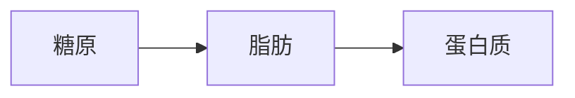

::: tip
体重下降了，减肥成功了，体重上升了，减肥失败了，事实真的是这样吗？其实，减肥并不单单是体重的变化，减肥并不是减脂，只有减脂成功才能减肥成功，而减肥成功并不代表减脂成功。
:::
## 减脂和减肥的却别
1. 减肥是指体重轻了，但身体的整体形态并无变化
2. 减脂不一定要减重，减脂是脂肪少了体重有可能没有轻但身体非常有型

## 减肥的目的
我们减肥真正的目的是：让身体变得健康，美丽，窈窕，有形，要做到穿衣显瘦，脱衣有肉，而这也是减脂的目标。 
我们减肥减的不是重量，而是减的围度，真正有效的减肥方式应该是通过减脂来监测身体的水分、脂肪以及肌肉的变化，从而达到减脂，而不是其他营养成分的丢失。
## 认识身体
我们人体体重基本是由水、肌肉、骨骼、食物残渣还有脂肪所组成的，而体重数据的波动主要受脂肪，水分，食物残渣影响。 
因此我们减肥重要的措施就是怎么减掉脂肪，如果说在减肥的过程中身体的脂肪没有燃烧掉，而只是水分排出了体外，那么这种反弹的几率是非常高的。
## 三大营养素
**碳水化合物**、**脂肪**、**蛋白质**  
碳水、脂肪、蛋白质在人体中起着至关重要的功能，对于人体来说都是不可或缺的，但是三种营养素的存储方式不一样。 
**蛋白质：** 蛋白质过多时会被身体转化为糖类储存起来 
**脂肪：** 脂肪过多会直接以脂肪形式被储存起来 
**碳水化合物：** 碳水过多则会被转化为糖原储存于肌肉或肝脏中 
身体对三大营养素的消耗顺序：

我们已经认识到减脂的最终目标是减掉脂肪，而减掉脂肪健康方案：**节食减脂加运动减脂** 
## 节食减脂
减肥主要就是减脂肪，所以脂肪摄入是首先要控制的，而碳水和蛋白质都不易存储为脂肪，碳水也会影响身体原有脂肪的消耗。 
那是不是不摄入任何碳水与脂肪，就能减肥了？ 
人体的三大营养素各有各的作用，不仅缺一不可，设置摄入过低，都会影响减肥的效果。 
比如低碳减肥，如果你不吃五谷杂粮，只靠吃肉增加蛋白质减肥，碳水摄入过低，那你可能会长时间处于低血糖状态，精神不好，容易疲劳，很多运动都无法负荷，更甚者，影响激素水平，进而影响新陈代谢。 
只靠吃肉增加蛋白质，则也容易摄入脂肪，单纯蛋白质过多，则会给肾脏造成严重负担，容易引发肾脏疾病 
如果完全不摄入任何脂肪，则会导致身体缺乏各种维生素，肝脏得不到有效保护，代谢也不平衡，容易便秘 
所以在节食期间三大营养要素没人每日都要摄入，只不过是需要控制量。 
碳水化合物45~65%，蛋白质10~35%，脂肪20~35%，只要你的摄入量在这个区间内，都是健康的。也就是说，即便要减肥，碳水摄入量每天最低也要占45%，脂肪摄入量每天最低也要占20%

## 运动减脂
如果体脂率较高，达到了20%到30%，我们最好采取有氧运动，进行慢跑，消耗体内的脂肪，降低我们的体脂率。 
如果体脂率较低，想要增肌，最好就不要进行有氧运动，这样会消耗我们大量的肌肉，导致我们肌肉的力量变弱。 
如果体脂率过高，只做无氧而不做有氧，其实健身可以很好的消耗我们的脂肪，但是更多的是会把脂肪变成肌肉，这样会让我们的肌肉越来越大，大腿越来越粗，身材也会走样，越变越难看。 
所以，体脂过高，健身前可以进行30分钟的有氧运动，这样既可以充分的热身为下一步健身做好准备，同时也可以消耗体内的脂肪。 

