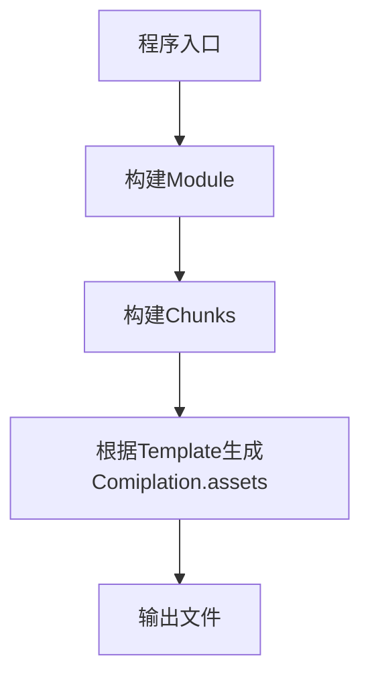
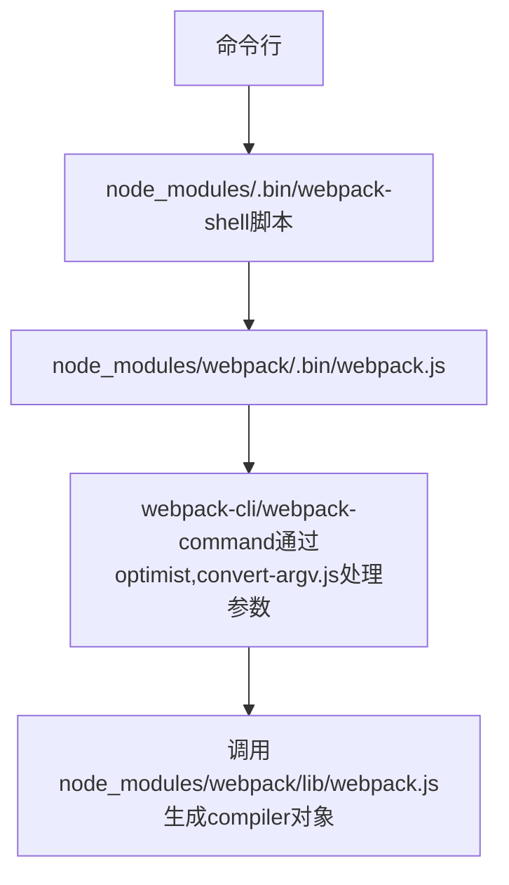
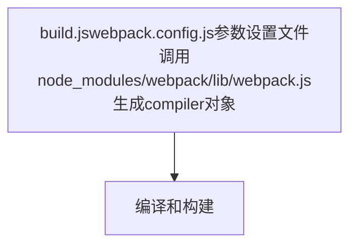

# Webpack 工作流程

## 流程图





### 调试
1. 假设 `./script/build.js`是你想要开始调试的地址
   ``` bash
   node --inspect-brk ./script/build.js --inline --progress
   ```
2. 打开`chrome://inspect/#devices`即可调试


## 1. shell 与 config 解析
每次在命令行输入webpack后，操作系统都会去调用`./node_modules/.bin/webpack`这个shell脚本。这个脚本会去调用`./webpack/bin/webpack.js`并追加输入的参数，如-p，-w。该webpack.js会去调用`webpack-cli/"webpack-command`使用其中的一个包，在cli/command的包中webpack通过optimist将shell脚本传过来的参数整合成options对象传到了下一个流程的控制对象中。
下面是webpack启动文件
``` bash
# 这是 ./node_modules/.bin/webpack的 代码 
#!/bin/sh
basedir=$(dirname "$(echo "$0" | sed -e 's,\\,/,g')")

case `uname` in
    *CYGWIN*) basedir=`cygpath -w "$basedir"`;;
esac

if [ -x "$basedir/node" ]; then
  "$basedir/node"  "$basedir/../webpack/bin/webpack.js" "$@"
  ret=$?
else 
  node  "$basedir/../webpack/bin/webpack.js" "$@"
  ret=$?
fi
exit $ret
```


### optimist

 和commander一样，optimist实现了node命令行的解析，optimist是node一个库，用于解析options，options对与optimist来说就是一个hash值
 ```javascript 
var optimist = require("optimist");
optimist
    .boolean("json").alias("json", "j").describe("json")
    .boolean("colors").alias("colors", "c").describe("colors")
    .boolean("watch").alias("watch", "w").describe("watch")
    ...
 ```
获取到后缀参数后，optimist分析参数并以键值对的形式把参数对象保存在optimist.argv中，
```javascript
    // webpack --hot -w  经optimist解析后 optimist.argv
    {
        hot:true,
        profile:false,
        watch:true,
        ...
    }
```
### config 合并与插件加载（加载webpack默认的一些plugins）
在加载插件之前，webpack将webpack.config.js中的各个配置项拷贝到options对象中，并加载用户配置在webpack.config.js的plugins。接着optimist.argv会被传入到`./node_modules/webpack/bin/convert-argv.js`中，通过判断argv中参数的值决定是否去加载对应的插件
``` javascript
ifBooleanArg("hot",function(){
    ensureArray(options,"plugins");
    var HotModuleReplacementPlugin = require("../lib/HotModuleReplacementPlugin");
    options.plugins.push(new HotModuleReplacementPlugin());
});
....
return options;
```
options作为最后返回的结果，包含了之后构建阶段所需的重要信息

``` javascript
// options 
{
    entry:{},// 入口配置
    output:{}, // 输出配置
    plugins:[], // 插件集合（配置文件 + shell指令）
    module:{loaders:[[Object]]}, // 模块配置
    context: // 工程路径
}
```
这个对象和webpack.config.js的配置非常相似，只是多了一些经shell传入的插件对象。插件对象一初始化完毕，options也就传入到了下个流程中。

``` javascript
// 这个是webpack-cli 中cli.js的声明
var webpack = require("webpack")
let compiler = webpack(options);
```

### 入口
入口处在`build.js`，可以看到其中的代码是先实例化webpack，然后调用complier的run方法
```javascript
// script/build.js 中用户启动webpack的代码
function build(build){
    let complier = webpack(config);
    return new Promise((resolve,reject)=>{
        compiler.run((err,stats)=>{
            ...
        })
    })
}
```
``` javascript
//  webpack/lib/webpack.js
function webpack(options,callback){
  ......
    let compiler;
    // 处理多个入口
    if(Array.isArray(options)){
        compiler = new MultiCompiler(options.map(options=>webpack(options)));
    }else if(type of options ==="object"){
        // webpack 的默认参数
        options = new WebpackOptionsDefaulter().process(options);
        console.log(options)
        // 实例化compiler 
        compiler = new Compiler(options.context)
        compiler.options = options
        // 对webpack的运行环境处理
        new NodeEnvironmentPlugin().apply(compiler);
        // 这里是为了注册插件
        if(options.plugins&& Array.isArray(options.plugins)){
            for(const plugin of options.plugins){
                plugin.apply(compiler)
            }
        }
        // 触发两个时间点 environment/afterEnviroment
        compiler.hooks.enviroment.call();
        compiler.hooks.afterEnviroment.call();
        // 设置compiler的属性并调用默认配置的插件，同时触发事件点 entry-option
        compiler.options = new WebpackOptionsApply().process(options,compiler);
    }else{
        throw new Error("Invalid argument:options");
    }
    if(callback){
        ......
        compiler.run(callback)
    }
    return compiler;
}
```


## 2. 编译与构建流程


## 3.打包输出


### 参考链接

- [细说 webpack 之流程篇](https://developer.aliyun.com/article/61047) 