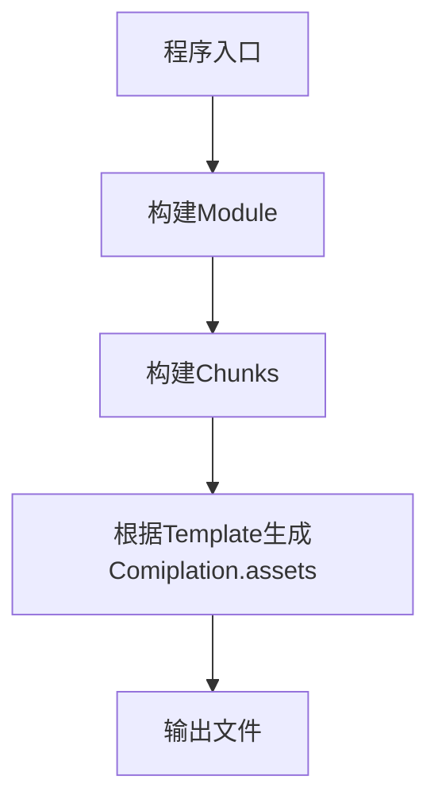

# Webpack 工作流程

## 调试
1. 假设 `./script/build.js`是你想要开始调试的地址
   ``` bash
   node --inspect-brk ./script/build.js --inline --progress
   ```
2. 打开`chrome://inspect/#devices`即可调试

## 流程图

## 入口
入口处在`build.js`，可以看到其中的代码是先实例化webpack，然后调用complier的run方法
```javascript
function build(build){
    let complier = webpack(config);
    return new Promise((resolve,reject)=>{
        compiler.run((err,stats)=>{
            ...
        })
    })
}
```
## entry-option (compiler)
### webpack.js
webpack在node_modules下面的`\webpack\lib\webpack.js`


### 参考链接

- [细说 webpack 之流程篇](https://developer.aliyun.com/article/61047)