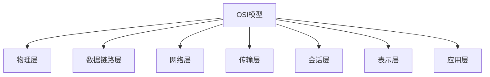
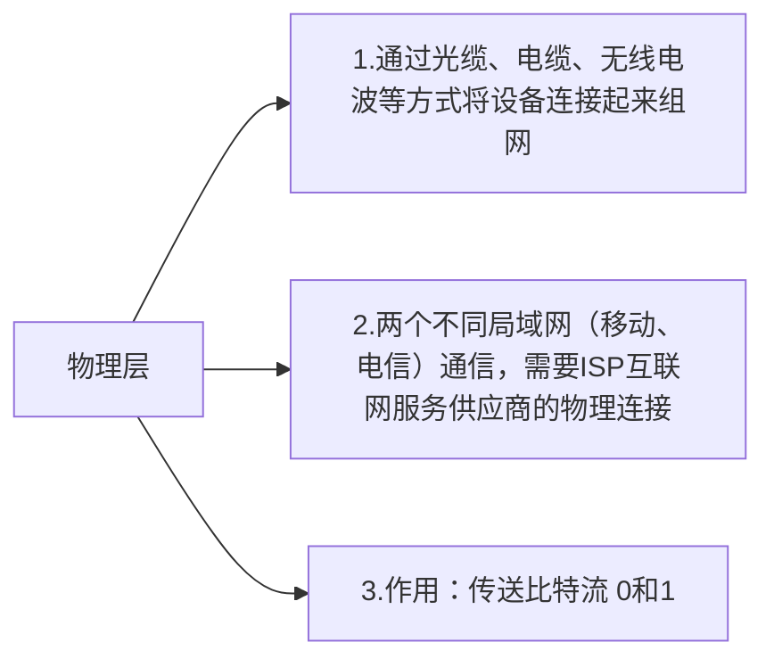
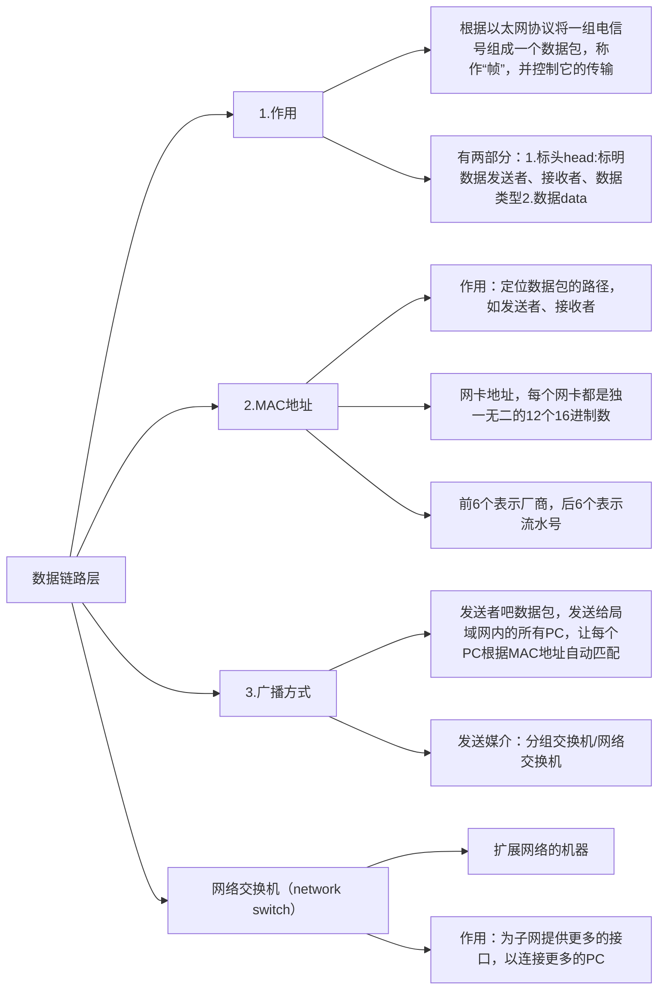
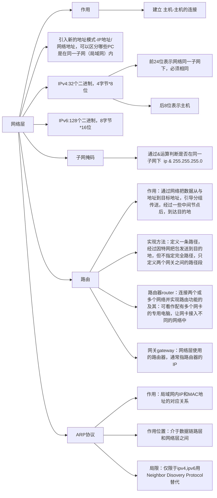
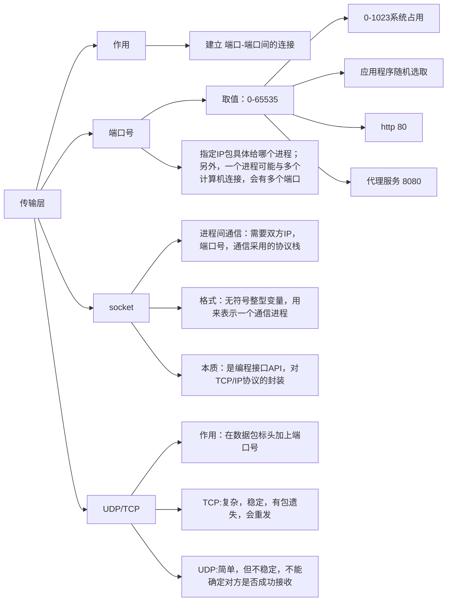
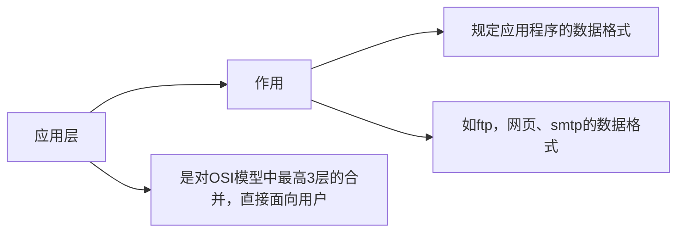
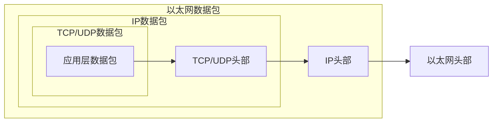

## 模型
OSI：open system interconnection 开放式系统互联参考模型 
OSI和TCP/IP的对应关系和协议
<table>
	<thead>
	    <th>OSI七层网络模型</th>
	    <th>TCP/IP四层概念模型</th>
	    <th>对应的网络协议</th> 
        <th>OSI各层基本作用</th> 
	</thead>
	<tr >
        <td>应用层（application）</td>
	    <td rowspan="3">应用层</td>
	    <td>HTTP、TFTP、FTP、NFS、WAIS、SMTP</td>
        <td>为应用程序提供网络服务</td>
	</tr>
	<tr>
	    <td>表示层（Presentation）</td>
	    <td>Telnet，Rlogin，SNMP，Gopher</td>
        <td>数据格式化，加密，解密</td>
	</tr>
	<tr>
	    <td>会话层（Session）</td>
	    <td>SMTP，DNS</td>
        <td>建立、维护、管理会话连接</td>
	</tr>
	<tr>
	    <td>传输层（Transport）</td>
	    <td>传输层</td>
        <td>TCP，UDP</td>
        <td>建立、维护、管理端到端连接</td>
	</tr>
	<tr>
        <td>网络层（Network）</td>
	    <td>网络层</td>
        <td>IP，ICMP，ARP，RARP，AKP，UUCP</td>
        <td>IP寻址和路由选择</td>
	</tr>
	<tr>
	    <td>数据链路层（Data Link）</td>
	    <td rowspan="2">数据链路层</td>
        <td>FDDI，Ethernet，Arpanet，PDN，SLIP，PPP</td>
        <td>控制网络层于物理层之间通信</td>
	</tr>
	<tr>
	    <td>物理层</td>
	    <td>IEEE 802.1A，IEEE 802.0到IEEE 802.11</td>
        <td>比特流传输</td>
	</tr>
</table>

## OSI模型详解

数据链路层数据包（以太网数据包）格式，除了应用层没有头部，其他都有

由于以太网数据包的数据部分，最大长度为1500字节，当IP包过大时，会分割下来，但是每个分割包的头部都一样

## 参考链接

- [OSI 7层模型和TCP/IP 4层模型](https://zhuanlan.zhihu.com/p/32059190) 