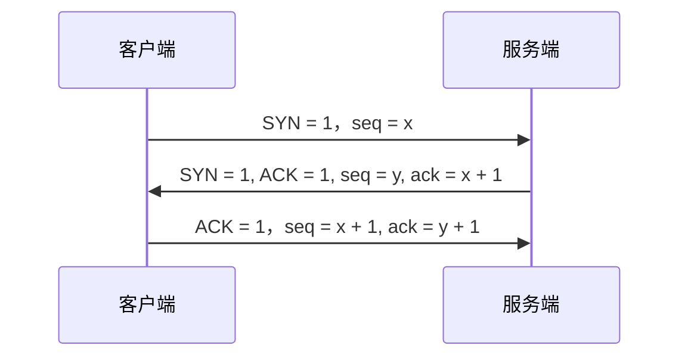

1. 请画出三次握手和四次挥手的示意图
2. 为什么连接的时候是三次握手？
3. 什么是半连接队列？
4. ISN(Initial Sequence Number)是固定的吗？
5. 三次握手过程中可以携带数据吗？
6. 如果第三次握手丢失了，客户端服务端会如何处理？
7. SYN攻击是什么？
8. 挥手为什么需要四次？
9. 四次挥手释放连接时，等待2MSL的意义?
通过这些问题，我们去认识tcp的三次握手四次挥手
## 三次握手
三次握手（Three-way Handshake）其实就是指建立一个TCP连接时，需要客户端和服务端总共发送三个包。进行 **三次握手的主要作用：** 就是为了确认双方的接受能力和发送能力是否正常、指定自己的初始化序列号为后面的可靠性传送做准备。实质上是连接服务器指定端口，建立TCP连接，并同步连接双方的序列号和确认号，交换 **TCP窗口大小** 的信息。 
刚开始客户端处于Closed的状态，服务端处于Listen状态。进行三次握手： 

- 第一次握手：客户端给服务端发送一个SYN报文，并指明客户端的初始化序列号ISN（C）。此时客户端处于**SYN_SEND**的状态。 
  
  首部的同步位SYN=1，初始序号seq = x , SYN = 1的报文段不能携带数据，但要消耗掉一个序号。 
- 第二次握手：服务器收到客户端的SYN报文之后，会以自己的SYN报文作为应答，并且也是指定了自己的初始化序列号ISN（S）。同时会把客户端的ISN + 1作为ACK的值，表示自己已经收到了客户端的SYN，此时服务器处于**SYN_RCVD**的状态。 
  在确认报文段中SYN = 1 ，ACK = 1， 确认号 ack = x + 1，初始序列号 seq = y。 
- 第三次握手：客户端收到SYN报文后，会发送一个ACK报文，当然，也是一样把服务器的ISN + 1作为ACK的值，表示已经收到了服务端的SYN报文，此时客户端处于**ESTABLISHED**的状态。服务器收到ACK报文后，也处于**ESTABLISHED**状态，此时，双方已经建立了连接。 
  
确认报文段ACK = 1， 确认号ack = y + 1，序号seq = x + 1 （初始位seq = x，第二个报文段所以要 +1），ACK报文段可以携带数据，不携带数据则不消耗序号。 
发送第一个SYN的一端将执行主动打开（active open），接收这个SYN并发送下一个SYN的另一端执行被动打开（passive open）。 
在socket中，客户端执行connect（）将触发三次握手。 

## 为什么需要三次握手，两次不行吗
如客户端发出连接请求，但因连接请求报文丢失而未收到确认，于是客户端再重传一次连接请求。后来收到了确认，建立了连接。数据传输完毕后，就释放了连接，客户端共发出了两个连接请求报文段，其中第一个丢失，第二个到达了服务端，但是第一个丢失的报文段只是在某些网络结点长时间滞留了，延误到连接释放以后的某个时间才到达服务端，此时服务端误认为客户端又发出一次新的连接请求，于是就向客户端发出确认报文段，同意建立连接，不采用三次握手，只要服务端发出确认，就建立新的连接了，此时客户端忽略服务端发来的确认，也不发送数据，则服务端一直等待客户端发送数据，浪费资源。
## 什么是半连接队列
服务器第一次收到客户端的SYN之后，就会处于SYN_RCVD状态，此时双方还没有建立连接，服务器会把此种状态下的请求连接放在一个队列中，我们把这种队列称之为半连接队列 
当然还有全连接队列，就是已经完成三次握手，建立起连接的就会放在全连接队列中，如果队列满了，就有可鞥会出现丢包的现象。
## ISN是固定的吗
当一段为建立连接而发送他的SYN时，它为连接选择一个初始序号。ISN随时间而变化，因此每个连接都将具有不同的ISN，ISN可以看作是一个32比特的计数器，没4ms加1，这样选择序号的目的在于防止在网络中被延迟的分组在以后又被重传，而导致某个连接的一方对它做错误的解释。 
三次握手的其中一个重要功能时客户端和服务端交换ISN，以便让对方知道接下来接收数据的时候如何按序列号组装数据。如果ISN是固定的，攻击者很容易猜出后续的确认号，因此ISN是动态生成的。
## 三次握手过程中可以携带数据吗？
第三次的时候是可以携带数据的，但是第一次和第二次是不可以携带数据的。 
为什么这样？假如第一次握手可以携带数据的话，如果有人恶意攻击服务器，那他每次都在第一次握手中的SYN报文中携带大量的数据，因为攻击者不会理会服务器的接收发送能力是否正常，然后疯狂重复发SYN报文的话，这会让服务器花费很多时间内存空间来接受这些报文。第三次可以发送是因为客户端已经处于ESTABLISHED状态，对于客户端来说已经知道服务器的能力了。
## SYN攻击是什么
服务器端的资源分配是在二次握手时分配的，而客户端的资源是在完成三次握手时分配的，所以服务器容易受到SYN泛攻击。SYN攻击就是Client在短时间内味道大量不存在的IP地址，并向服务端不断发送SYN包，server则回复确认包，并等待Client确认，由于源地址不存在，因此Server需要不断重发直至超时，这些伪造的SYN包将长时间占用未连接队列，导致正常的SYN请求因为队列满而被丢弃，从而引起网络拥塞甚至系统瘫痪，SYN是一种典型的DoS/DDoS攻击 
解决方案：1. 缩短超时时间（SYN Timeout）2. 增加最大半连接数3.过滤网关防护4. SYN cookies技术
## 四次挥手
建立一个连接需要三次握手，而终止一个连接需要经过四次挥手。这由TCP的半关闭（half-close）造成的。所谓的半关闭，其实就是TCP提供了连接的一端在结束它的发送后还能接收来自另一端数据的能力。 

TCP连接的拆除需要发送四个包，因此称为四次挥手，客户端或服务器均可主动发起挥手动作。 

一开始双方都处于ESTABLISHED状态，假如是客户端发起关闭请求。四次挥手的过程如下：
- 第一次挥手：客户端发送一个FIN报文，报文中会指定一个序列号。此时客户端处于FIN_WAIT1状态。即发出连接释放报文段（FIN=1，序列号seq = u）,并停止在发送数据，主动关闭TCP连接，进入FIN_WAIT1状态，等待服务端确认。
- 第二次挥手：服务端收到FIN之后，会发送ACK报文，并且把客户端的序列号+1作为ACK报文的序列号值，表明已经接收到客户端的报文了，此时服务端处于CLOSE_WAIT状态。即服务端收到连接释放报文段后即发出确认报文段（ACK= 1，确认号ack =u+1，序号 seq = v）服务端进入CLOSE_WAIT状态，此时的TCP处于半关闭状态，客户端到服务端的连接释放。客户端收到服务端的确认后，进入FIN_WAIT2状态，等待服务端发出的连接释放报文段。
- 第三次挥手：如果服务端也想断开连接了，和客户端第一次挥手一样，发给FIN报文，并且指定一个序列号。此时服务端处于LAST_ACK的状态。即服务端没有要向客户端发出的数据，服务端发出连接释放报文段（FIN = 1，ACK=1，序号 seq = w ,确认号ack = u+1），服务端进入LAS_ACK状态，等待客户端的确认。
- 第四次挥手：客户端收到FIN之后，一样发送一个ACK报文作为应答，并且把服务端的序列号值+1作为自己ACK报文的序列号值，此时客户端处于TIME_WAIT 状态。需要过一阵子以确保服务端收到自己的ACK报文之后才会进入CLOSED状态，服务端收到ACK报文后，就关闭连接，处于CLOSED的状态，即客户端收到的服务端的连接释放报文段后，对此发出确认报文段（ACK = 1 ，seq = u+1,ack = w+1）,客户端进入TIME_WAIT状态，此时TCP未释放掉，需要经过时间等待计时器设置的时间2MSL后，客户端才进入CLOSED状态。 

收到一个FIN只意味着在这一方向上没有数据流动。客户端执行主动关闭并进入TIME_WAIT是正常的，服务端通常执行被动关闭，不会进入TIME_WAIT状态。 
在socket中，任何一方执行close（）操作即可产生挥手操作
## 为什么需要四次
因为服务端接收到客户端的SYN连接请求报文后，可以直接发送SYN+ ACK 报文。其中ACK报文是用来应答的，SYN报文是用来同步的。但是关闭连接时，当服务端收到FIN报文时，很可能并不会立即关闭SOCKET，所以只能先回复一个ACK报文，告诉客户端”你发送的FIN报文，我收到了“只有等到服务端所有的报文都发送完了，没有数据发送了，服务端就也可以发送FIN报文，因此需要四次挥手
## 2MSL等待状态
TIME_WAIT状态也成为2MSL等待状态。每个具体TCP实现必须选择一个报文段最大生存时间MSL（Maximum Segment Lifetime），它是任何报文段被丢弃前咋网络内的最长时间。这个时间是有限的，因为TCP报文段以IP数据包则有限制其生存时间的TTL字段。 

对一个具体实现所给定的MSL值，处理的原则时：当TCP执行一个主动关闭，并发回最后一个ACK，该连接必须在TIME_WAIT状态停留的时间为2倍的MSL。这样可让TCP再次发送最后的ACK以防这个ACK丢失（另一端超时并重发最后的FIN）。

这种2MSL等待的另一个结果时这个TCP连接在２MSL等待时间，定义这个连接窗口（客户的IP地址和端口号，服务器的IP地址和端口号）不能在被使用。这个连接只能在２MSL结束后才能在被使用。
## 四次挥手释放连接时，等待2MSL的意义
>MSL是Maximum Segment Lifetime的英文缩写，可译为”最长报文段寿命“，它是任何报文在网络上存在的最长时间，超过这个时间报文将被丢弃。

为了保证客户端发送的最后一个ACK报文段能够到达服务器。因为这个ACK有可能丢失，从而导致处在LAST-ACK状态的服务器收不到对FIN-ACK的确认报文。服务器会超时重传这个FIN-ACK，接着客户端在重传一次确认，重新启动时间等待计时器。最后客户端和服务器都能正常的关闭。假设客户端不等待2MSL，而是在发送完ACK之后直接释放关闭，一旦这个ACK丢失的话，服务器就无法正常的进入关闭连接状态。

**两个理由：** 
1. 保证客户端发送的最后一个ACK报文段能够到达服务端。这个ACK报文段有可能丢失，使得处于LAST-ACK状态的B收不到对已发送的FIN + ACK报文段的确认，服务端超时重传FIN + ACK报文段，而客户端能在2MSL时间内收到这个重传的FIN＋ACK报文段，接着客户端重传一次确认，重新启动２MSL计时器，最后客户端和服务端都进入到CLOSED状态，若客户端在TIME-WAIT状态不等待一段时间，而是发送完ACK报文段后立即释放连接，则无法收到服务端重传的FIN　＋　ACK报文段，所以不会在发送一次确认报文段，则服务端无法正常进入到CLOSED状态。
2. 防止”已失效的连接请求报文段“出现在本连接中。客户端在发送完最后一个ACK报文段后，再经过2MSL，就可以是本链接持续时间内产生的所有报文段都从网络中消失，使下一个新的连接中不会出现这种旧的连接请求报文段。

## 为什么TIME_WAIT状态需要经过2MSL才能返回到CLOSE状态
理论上，四个报文都发送完毕，就可以直接进入CLOSE状态了，但是可能网络是不可靠的，有可能最后一个ACK丢失，所以TIME_WAIT状态就是用来重发可能丢失的ACK报文。